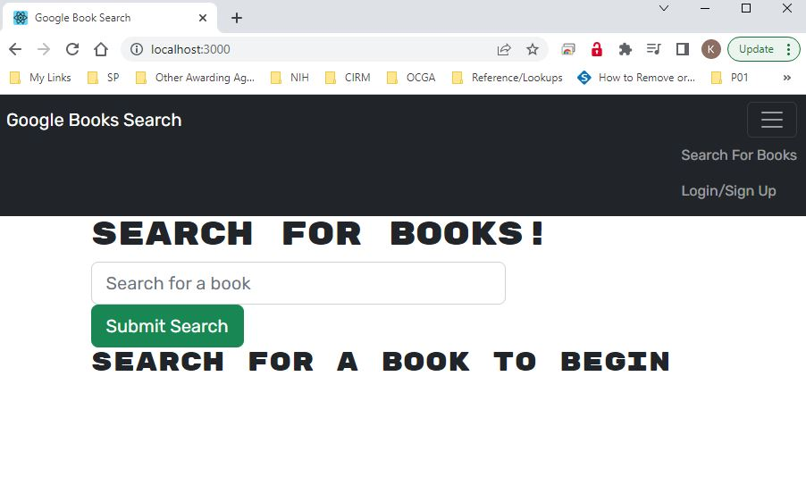
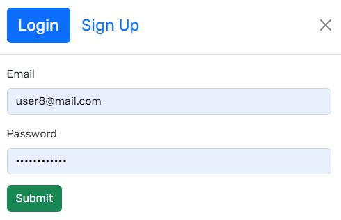
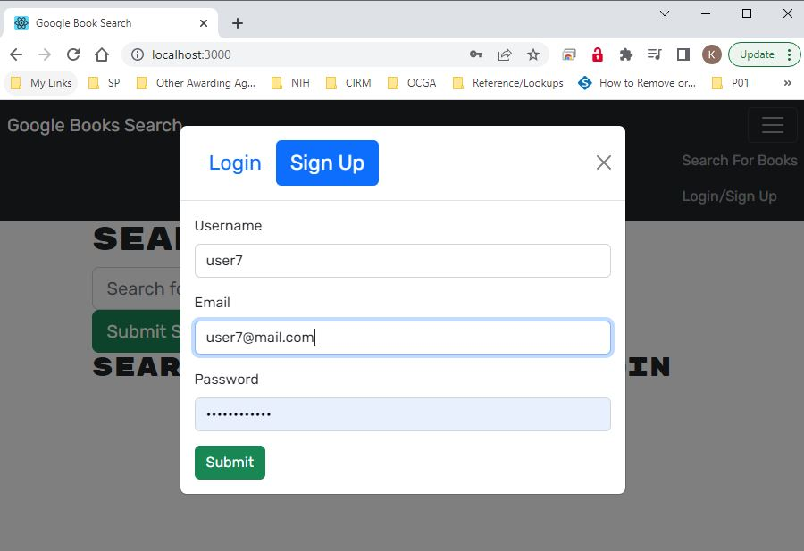
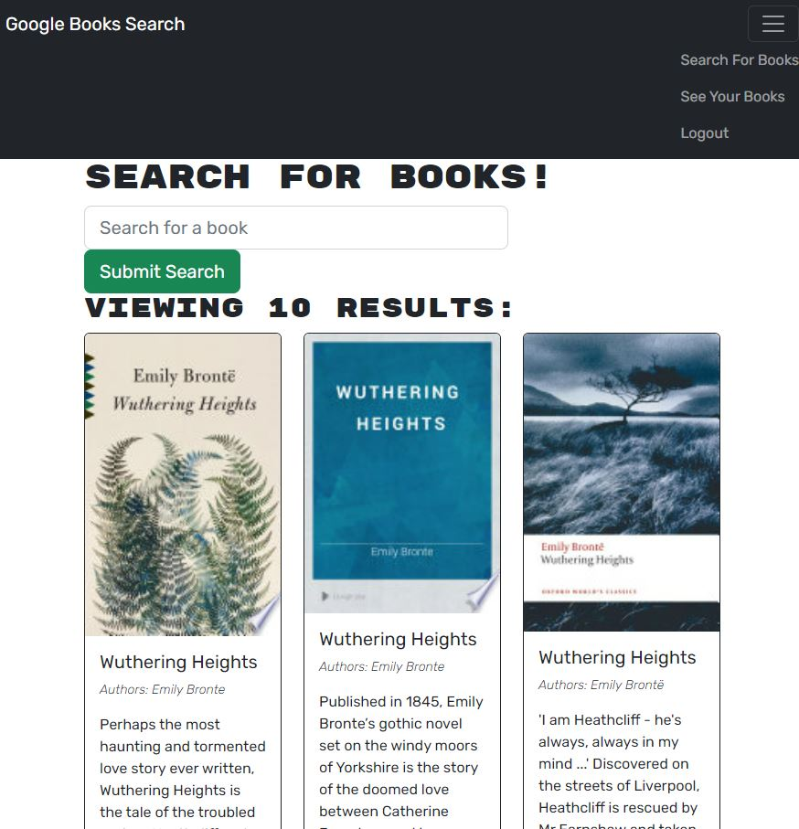
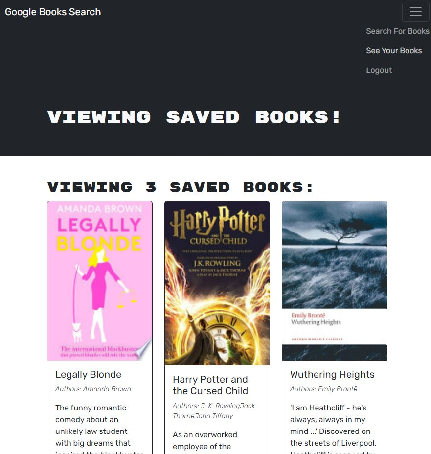

# Bibbli Bibbli Boo!

  

  ## Table of Contents
  1. [Project Description](#project-description)
  2. [Installation Instructions](#installation-instructions)
  3. [How To Use](#how-to-use)
  4. [How To Contribute](#how-to-contribute)
  5. [Testing](#testing)
  6. [License](#license)
  7. [Contact Me](#contact-me)

  ## Project Description
  * This site allows users to create an account and save their favorite books in a personal library

  ## Installation Instructions
  * This application should be used via web interface, no installation required.

  ## How To Use
  * This application provides an online library record so users can save and refer to favorite books on any device with web capabilities!

  ## How To Contribute
  * Contact me on GitHub to Contribute!
  
  ## Testing
  * None

  ## License
  * Licensed under [ISC License](https://choosealicense.com/licenses/isc)
  

  ## Contact Me
  * Find me on Github: [kabdomora](http://github.com/kabdomora)
  * For additional feedback, email me at [kaylabrown@mednet.ucla.edu](mailto:kaylabrown@mednet.ucla.edu)

  
  
  
  
  
